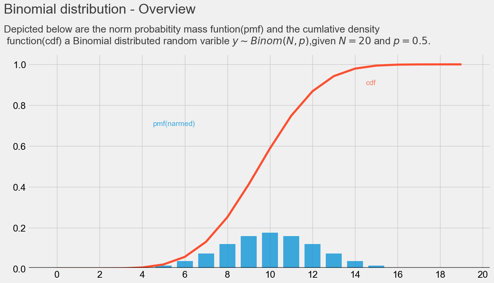
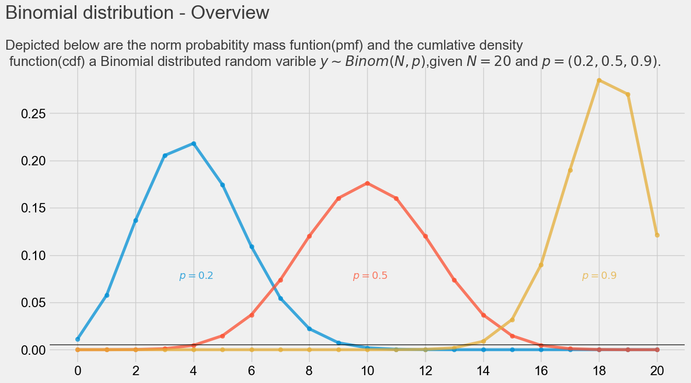
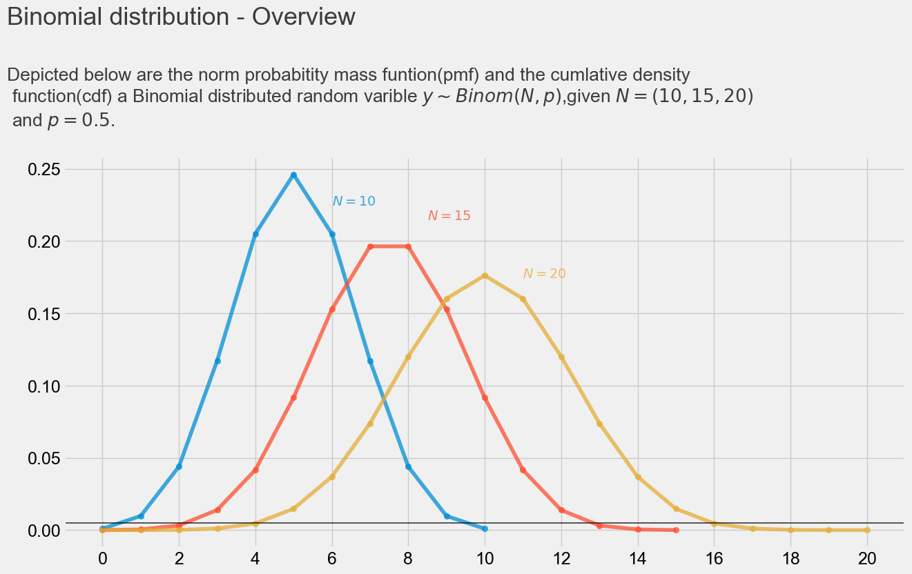
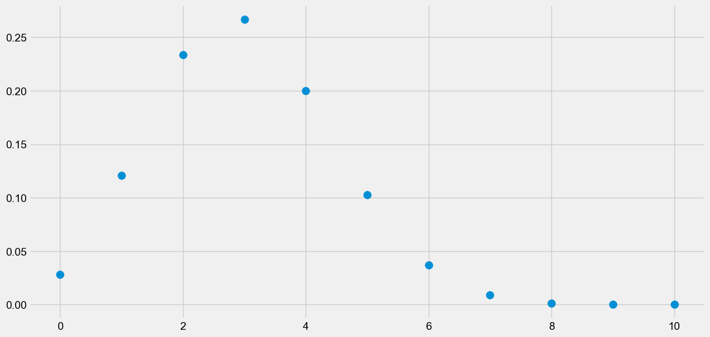

# 二项分布 （Binomial distribution）
> 定义

在概率论和统计学中，二项分布是n个独立的成功/失败试验中成功的次数的离散概率分布，其中每次试验的成功概率为p。这样的单次成功/失败试验又称为伯努利试验。实际上，当`n=1`时，二项分布就是伯努利分布。 [2] 
一般地，如果随机变量服从参数为和的二项分布，我们记为或。n次试验中正好得到k次成功的概率由概率质量函数给出： [2] 


式中`k=0，1，2，…，n`,是二项式系数（这就是二项分布名称的由来），又记为或者。 该公式可以用以下方法理解：我们希望有k次成功(p)和n−k次失败(1 −p)。并且，k次成功可以在n次试验的任何地方出现，而把k次成功分布在n次试验中共有个不同的方法。

在上述说明的基础上，二项式的属性包括： 
1. 每个试验都是独立的。 
2. 实验中只有两个可能的结果：成功和失败。 
3. 总共进行了相同地n次实验。 
4. 所有实验成功和失败的概率是相同的。（所有实验都是相同的）

PMF （概率质量函数）对离散随机变量的定义，是离散随机变量在各个特定取值的概率。该函数通俗来说，就是对一个离散型概率事件来说，使用该函数来求它各个成功事件结果的概率。 

PDF (概率密度函数） 是对连续型随机变量的定义，与PMF不同的是，在特定点上的值并不是该点的概率，连续随机概率事件只能求连续一段区域内发生事件的概率，通过对这段区间进行积分，可获得事件发生时间落在给定间隔内的概率

> PLOTTING CONFIG 绘图配置
```
# PLOTTING CONFIG 绘图配置
style.use('fivethirtyeight')
plt.figure(dpi=100,figsize=(14,7))
#### font.sans-serif 解决中文乱码问题
# WIN
# plt.rcParams["font.sans-serif"]=["SimHei"]
# MAC
plt.rcParams['font.sans-serif'] = ['Arial Unicode MS']
plt.rcParams["axes.unicode_minus"] = False
```
> 二项分布（Binomial distribution）图

```
def binomial1():
    # PMF ~ PDF
    plt.bar(x=np.arange(20),height=(stats.binom.pmf(np.arange(20),p=0.5,n=20)),width=.75,alpha=.75)

    # CDF
    plt.plot(np.arange(20),stats.binom.cdf(np.arange(20),p=.5,n=20) ,color='#fc4f30')
    # LEEND
    plt.text(x=4.5, y=.7,s="pmf(narmed)",alpha=.75,weight="bold",color="#008fd5")
    plt.text(x=14.5,y=.9,s="cdf",alpha=.75,weight="bold",color="#fc4f30")
    # plt.text(x=-.4, y=.5, s="cdf", rotation=55, alpha=0.75, weight="bold", color="#fc4f30")

    # TICKS which : {'major',  'minor',  'both'}
    plt.xticks(range(21)[::2])
    plt.tick_params(axis="both",which="major",labelsize=18)
    plt.axhline(y=0.005,color="black",linewidth=1.3, alpha=.7)

    # TITLE
    plt.text(x=-2.5,y=1.25,s="Binomial distribution - Overview" ,fontsize=26 ,weight='bold',alpha=.75)
    plt.text(x=-2.5,y=1.1,s="Depicted below are the norm probabitity mass funtion(pmf) and the cumlative density \n"+
                " function(cdf) a Binomial distributed random varible $y \\sim Binom(N, p)$,given $N = 20$ and $p = 0.5$."
             ,fontsize=19 ,weight='bold',alpha=.75)
    plt.savefig('static/1.png', bbox_inches='tight')
    plt.show()
```
> 输出结果（Output results）

text: `下面描述的是范数概率质量函数（pmf）和累积密度函数（cdf）是一个二项分布的随机变量`


> 概率 p 对实验的影响
```
def binomial2():
    # 概率 P 对结果的影响
    # PMF  P= .2
    plt.scatter(np.arange(21),stats.binom.pmf(np.arange(21),p=.2,n=20),alpha=.75)
    # PMF
    plt.plot(np.arange(21),stats.binom.pmf(np.arange(21),p=.2,n=20) ,alpha=.75)

    # PMF  P= .5
    plt.scatter(np.arange(21),stats.binom.pmf(np.arange(21),p=.5,n=20),alpha=.75)
    plt.plot(np.arange(21),stats.binom.pmf(np.arange(21),p=.5,n=20) ,alpha=.75)
    # PMF  P= .9
    plt.scatter(np.arange(21),stats.binom.pmf(np.arange(21),p=.9,n=20),alpha=.75)
    plt.plot(np.arange(21),stats.binom.pmf(np.arange(21),p=.9,n=20) ,alpha=.75)

    # LEEND
    plt.text(x=3.5, y=.075,s="$p = 0.2$",alpha=.75,weight="bold",color="#008fd5")
    plt.text(x=9.5,y=.075,s="$p = 0.5$",alpha=.75,weight="bold",color="#fc4f30")
    plt.text(x=17.4, y=.075, s="$p = 0.9$", alpha=0.75, weight="bold", color="#e5ae38")

    # TICKS which : {'major',  'minor',  'both'}
    plt.xticks(range(21)[::2])
    plt.tick_params(axis="both",which="major",labelsize=18)
    plt.axhline(y=0.005,color="black",linewidth=1.3, alpha=.7)

    # TITLE
    plt.text(x=-2.5,y=.35,s="Binomial distribution - Overview" ,fontsize=26 ,weight='bold',alpha=.75)
    plt.text(x=-2.5,y=.3,s="Depicted below are the norm probabitity mass funtion(pmf) and the cumlative density \n"+
                " function(cdf) a Binomial distributed random varible $y \\sim Binom(N, p)$,given $N = 20$ and $p = (0.2,0.5,0.9)$."
             ,fontsize=19 ,weight='bold',alpha=.75)

    plt.savefig('static/2.png', bbox_inches='tight')
    plt.show()

```
> 输出结果（Output results）

text: `下面描述的是范数概率质量函数（pmf）和累积密度函数（cdf）是一个二项分布的随机变量,p 分别取(0.2,0.5,0.9)`


> 实验次数N 对结果的影响
```
def binomial3():
    # 次数 N 对结果的影响
    # PMF  N= 10
    plt.scatter(np.arange(11),stats.binom.pmf(np.arange(11),p=.5,n=10),alpha=.75)
    plt.plot(np.arange(11),stats.binom.pmf(np.arange(11),p=.5,n=10) ,alpha=.75)
    # PMF  N= 15
    plt.scatter(np.arange(16),stats.binom.pmf(np.arange(16),p=.5,n=15),alpha=.75)
    plt.plot(np.arange(16),stats.binom.pmf(np.arange(16),p=.5,n=15) ,alpha=.75)
    # PMF  N= 20
    plt.scatter(np.arange(21),stats.binom.pmf(np.arange(21),p=.5,n=20),alpha=.75)
    plt.plot(np.arange(21),stats.binom.pmf(np.arange(21),p=.5,n=20) ,alpha=.75)

    # LEEND
    plt.text(x=6, y=.225,s="$N = 10$",alpha=.75,weight="bold",color="#008fd5")
    plt.text(x=8.5,y=.215,s="$N = 15$",alpha=.75,weight="bold",color="#fc4f30")
    plt.text(x=11, y=.175, s="$N = 20$", alpha=0.75, weight="bold", color="#e5ae38")

    # TICKS which : {'major',  'minor',  'both'}
    plt.xticks(range(21)[::2])
    plt.tick_params(axis="both",which="major",labelsize=18)
    plt.axhline(y=0.005,color="black",linewidth=1.3, alpha=.7)

    # TITLE
    plt.text(x=-2.5,y=.35,s="Binomial distribution - Overview" ,fontsize=26 ,weight='bold',alpha=.75)
    plt.text(x=-2.5,y=.28,s="Depicted below are the norm probabitity mass funtion(pmf) and the cumlative density \n"+
                " function(cdf) a Binomial distributed random varible $y \\sim Binom(N, p)$,given $N = (10,15,20)$ \n and $p = 0.5$."
             ,fontsize=19 ,weight='bold',alpha=.75)

    plt.savefig('static/3.png', bbox_inches='tight')
    plt.show()
```

> 输出结果（Output results）

text: `下面描述的是范数概率质量函数（pmf）和累积密度函数（cdf）是一个二项分布的随机变量,N分别取(10,15,20)`


> 模拟采样
```shell script
def sample():
    # 定义随机种子
    np.random.seed(42)
    # 采样一个
    print(stats.binom.rvs(p=0.3,n=10))
    # 采样 10 个
    print(stats.binom.rvs(p=0.3,n=10,size=10))
    # Probability mass function 概率质量函数
    x_s = np.arange(11)
    y_s = stats.binom.pmf(x_s,p=.3,n=10)
    plt.scatter(x_s,y_s,s=100)
    plt.savefig('static/4.png', bbox_inches='tight')
    plt.show()

    # Cumulative distribution function
    print( "P(x<= 3) = {}".format(stats.binom.cdf(k=3,p=0.3,n=10)))
    print( "P(2< x <= 8) = {}".format(stats.binom.cdf(k=8,p=0.3,n=10) - stats.binom.cdf(k=2,p=0.3,n=10)))

```

> 输出结果（Output results）


out:
```shell script
P(x<= 3) = 0.6496107184000002
P(2< x <= 8) = 0.6170735277000002
```



