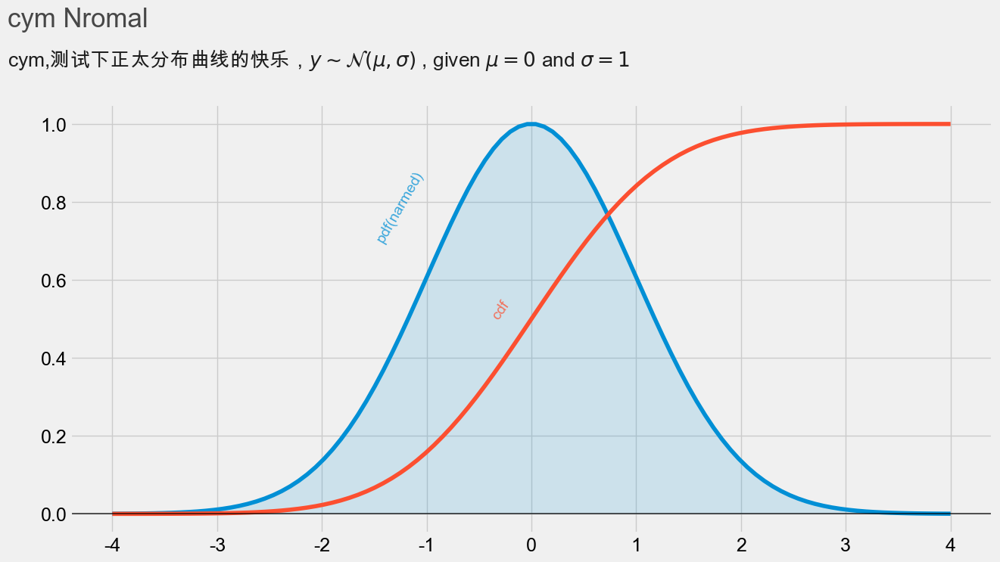
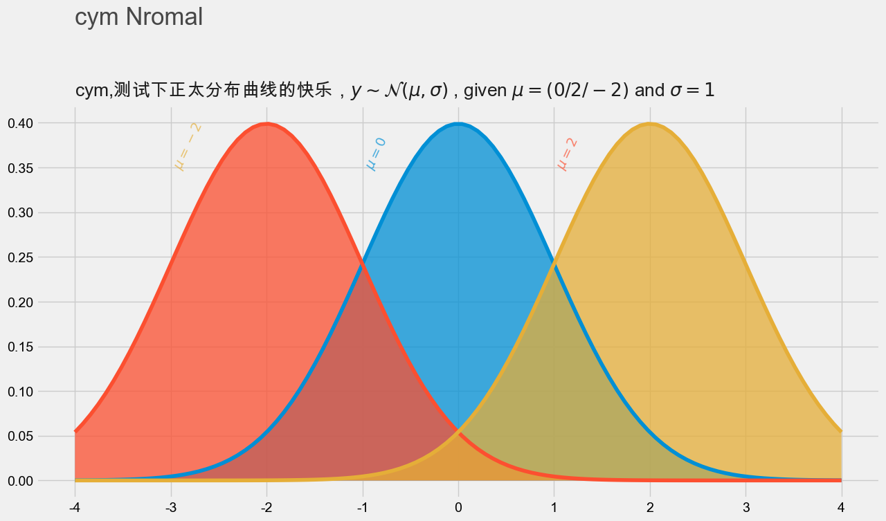
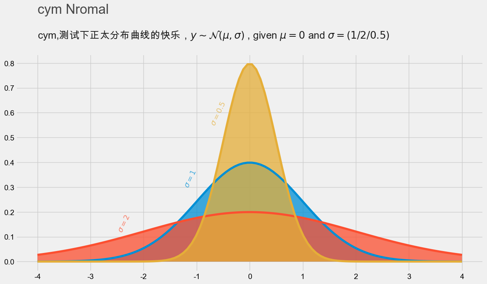
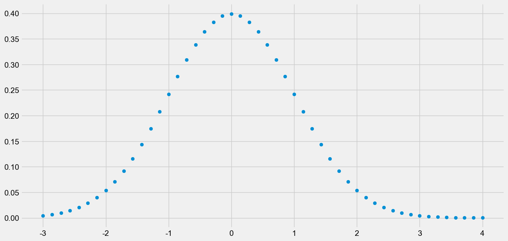
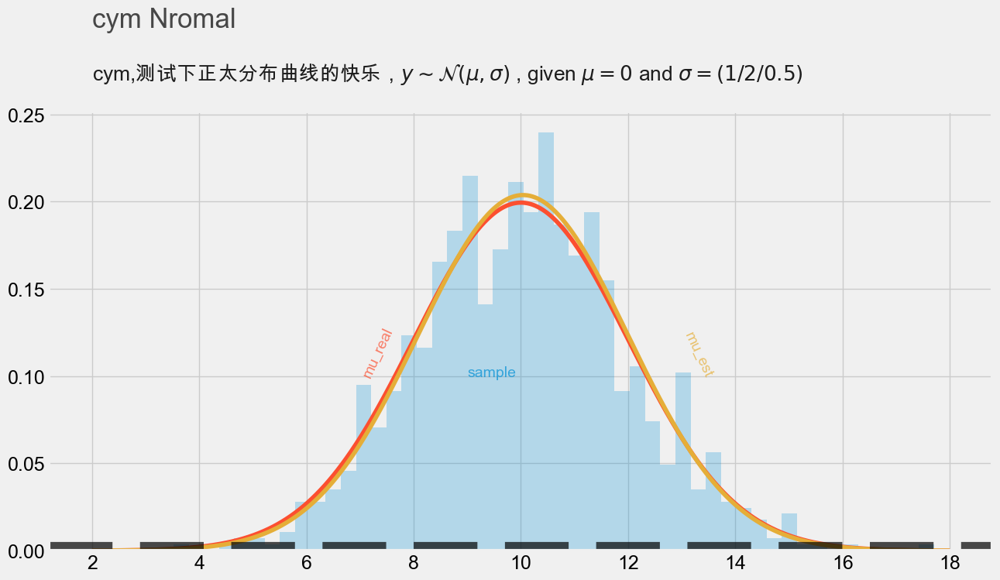

# 正太分布
正太分布图收到两个参数影响   
$ \\mu$     ==```loc # 均值```    
$ \\sigma$  ==```scale # 标准差```

## 绘制第一个正态分布图
> 引包

    import numpy as np
    import scipy.stats as stats
    import matplotlib
    import matplotlib.pyplot as plt
    import matplotlib.style as style
    from IPython.core.display import HTML
> 处理中文乱码问题

pyplot在绘制图像的时候，plt.text()函数在做文本填充可能会出现中文乱码【】【】
mac/Window 系统处理方式有一点点的区别，大家可以自行参考下面代码

    # Window
    # plt.rcParams["font.sans-serif"]=["SimHei"]
    # MAC
    plt.rcParams['font.sans-serif'] = ['Arial Unicode MS']
    plt.rcParams["axes.unicode_minus"] = False

> 初始化风格

    print(plt.style.available)
    # plt.style.use('ggplot')
    style.use('fivethirtyeight')
    plt.rcParams["figure.figsize"] = (14,7)
> 绘制正态分布图

    ##正太分布
    def show1():
        plt.figure(dpi=100)
        # PDF
        plt.plot(np.linspace(-4, 4, 100),
                 stats.norm.pdf(np.linspace(-4, 4, 100)) / np.max(stats.norm.pdf(np.linspace(-3, 3, 100))), )
        plt.fill_between(np.linspace(-4, 4, 100),
                         stats.norm.pdf(np.linspace(-4, 4, 100)) / np.max(stats.norm.pdf(np.linspace(-3, 3, 100))),
                         alpha=0.15, )
        # CDF
        plt.plot(np.linspace(-4, 4, 100), stats.norm.cdf(np.linspace(-4, 4, 100)))
    
        # LEEND
        plt.text(x=-1.5, y=.7, s="pdf(narmed)", rotation=60, alpha=0.75, weight="bold", color="#008fd5")
        plt.text(x=-.4, y=.5, s="cdf", rotation=55, alpha=0.75, weight="bold", color="#fc4f30")
    
        # TICKS
        plt.tick_params(axis='both', which='major', labelsize=18)
        plt.axhline(y=0, color='black', linewidth=1.3, alpha=.7)
    
        # TITLE
        plt.text(x=-5, y=1.25, s="cym Nromal", fontsize=25, weight='bold', alpha=.7)
        plt.text(x=-5, y=1.15,
                 s='cym,测试下正太分布曲线的快乐，$ y\\sim \\mathcal{N}(\\mu,\\sigma) $ , given $\\mu = 0$ and $\\sigma = 1$'
                 , fontsize=19, alpha=.88)
    
        plt.savefig('static/1.png', bbox_inches='tight')
        plt.show()
    #调用
    show1()
    
> 执行效果

[我的第一张正态分布图](static/1.png)




## 均值
$ \\mu$     ==```loc # 均值```    
> Code

```
def show2():
    plt.figure(dpi=100)
    # PDF MU = 0
    plt.plot(np.linspace(-4,4,100),stats.norm.pdf(np.linspace(-4,4,100)))
    plt.fill_between(np.linspace(-4,4,100),stats.norm.pdf(np.linspace(-4,4,100)),alpha=.75)
    # PDF MU = -2
    plt.plot(np.linspace(-4, 4, 100), stats.norm.pdf(np.linspace(-4, 4, 100) ,loc=-2))
    plt.fill_between(np.linspace(-4, 4, 100), stats.norm.pdf(np.linspace(-4, 4, 100),loc=-2), alpha=.75)

    # PDF MU = 2
    plt.plot(np.linspace(-4, 4, 100), stats.norm.pdf(np.linspace(-4, 4, 100),loc=2))
    plt.fill_between(np.linspace(-4, 4, 100), stats.norm.pdf(np.linspace(-4, 4, 100),loc=2), alpha=.75)

    # LEGEND
    plt.text(x=-1,y=0.35,s="$ \mu = 0 $",rotation=65,alpha=.7,weight="bold",color="#008fd5")
    plt.text(x=1,y=0.35,s="$ \mu = 2 $",rotation=65,alpha=.7,weight="bold",color="#fc4f30")
    plt.text(x=-3,y=0.35,s="$ \mu = -2 $",rotation=65,alpha=.7,weight="bold",color="#e5ae38")
    # TITLE
    plt.text(x=-4, y=.51, s="cym Nromal", fontsize=25, weight='bold', alpha=.7)
    plt.text(x=-4, y=.43,
             s='cym,测试下正太分布曲线的快乐，$ y\\sim \\mathcal{N}(\\mu,\\sigma) $ , given $\\mu = (0/2/-2)$ and $\\sigma = 1$'
             , fontsize=19, alpha=.88)

    plt.savefig('static/2.png', bbox_inches='tight')
    # plt.savefig('fig.png', bbox_inches ='tight')
    plt.show()
`````
> PlotShow

均值 $ \mu$ [不同的效果图](static/2.png)



## 标准差 scale
$ \\mu$     ==```loc # 均值```    
> Code

```
def show3():
    plt.figure(dpi=100)
    # PDF SIGMA = 1
    plt.plot(np.linspace(-4,4,100),stats.norm.pdf(np.linspace(-4,4,100),scale=1))
    plt.fill_between(np.linspace(-4,4,100),stats.norm.pdf(np.linspace(-4,4,100),scale=1),alpha=.75)
    # PDF SIGMA = 2
    plt.plot(np.linspace(-4, 4, 100), stats.norm.pdf(np.linspace(-4, 4, 100) ,scale=2))
    plt.fill_between(np.linspace(-4, 4, 100), stats.norm.pdf(np.linspace(-4, 4, 100),scale=2), alpha=.75)

    # PDF SIGMA = 0.5
    plt.plot(np.linspace(-4, 4, 100), stats.norm.pdf(np.linspace(-4, 4, 100),scale=.5))
    plt.fill_between(np.linspace(-4, 4, 100), stats.norm.pdf(np.linspace(-4, 4, 100),scale=.5), alpha=.75)

    # LEGEND
    plt.text(x=-1.25,y=0.3,s="$ \sigma = 1 $",rotation=65,alpha=.7,weight="bold",color="#008fd5")
    plt.text(x=-2.5,y=0.12,s="$ \sigma = 2 $",rotation=65,alpha=.7,weight="bold",color="#fc4f30")
    plt.text(x=-0.75,y=0.55,s="$ \sigma = 0.5 $",rotation=65,alpha=.7,weight="bold",color="#e5ae38")
    # TITLE
    plt.text(x=-4, y=1, s="cym Nromal", fontsize=25, weight='bold', alpha=.7)
    plt.text(x=-4, y=.9,
             s='cym,测试下正太分布曲线的快乐，$ y\\sim \\mathcal{N}(\\mu,\\sigma) $ , given $\\mu = 0$ and $\\sigma = (1/2/0.5)$'
             , fontsize=19, alpha=.88)
    plt.savefig('static/3.png', bbox_inches='tight')
    # plt.savefig('fig.png', bbox_inches ='tight')
    plt.show()
```

> PlotShow

标准差 $ \sigma$ [不同的效果图](static/3.png)


## 概率密度(probability density Function) & Cumulative distribution function
> stats.norm.pdf(x) 是获取正态分布在x 点的概率密度，
> stats.norm.cdf(x) 是获取正态分布在x 点的积分，
> code
```
def show4():
    x = -1
    y = 2
    stats.norm.pdf(x) # 概率密度 probability density Function
    print("pdf(x) = {} \npdf(x) = {}".format(stats.norm.pdf(x),stats.norm.pdf(y)))

    x_s = np.linspace(-3,4,50)
    y_s = stats.norm.pdf(x_s)
    plt.scatter(x_s,y_s)
    plt.savefig('static/4.png', bbox_inches='tight')
    plt.show()

    print("P(X < 0.3) = {}".format(stats.norm.cdf(0.3)))
    print("P(-0,2 < X < 0.2) = {}".format(stats.norm.cdf(0.2) - stats.norm.cdf(-.2)))
```
> out:
```
pdf(x) = 0.24197072451914337 
pdf(x) = 0.05399096651318806
P(X < 0.3) = 0.6179114221889526
P(-0,2 < X < 0.2) = 0.15851941887820603
```
> PlotShow

 [概率密度散点正太分布](static/4.png)


## 通过真实数据取样，进行画图

>code
``` 
def show5():
    #真实的数据
    mu_real = 10
    sigma_real = 2
    np.random.seed(42)
    sample = stats.norm.rvs(loc=mu_real,scale=sigma_real,size=1000)
    # 计算出样本数据的均值+ 标准差
    mu_est = np.mean(sample)
    sigma_est = np.std(sample)
    print("Estimated MU:{}\nEstimated SIGMA:{}".format(mu_est,sigma_est))

    ##### PLOTTING #####
    plt.hist(sample,bins=50,density =True ,alpha=.25)
    plt.plot(np.linspace(2,18,1000),stats.norm.pdf(np.linspace(2,18,1000),loc=mu_real,scale=sigma_real))
    plt.plot(np.linspace(2,18,1000),stats.norm.pdf(np.linspace(2,18,1000),loc=np.mean(sample),scale= np.std(sample)))

    # LEGEND
    plt.text(x=9,y=0.1,s="sample",alpha=.7,weight="bold",color="#008fd5")
    plt.text(x=7,y=0.1,s="mu_real",rotation=65,alpha=.7,weight="bold",color="#fc4f30")
    plt.text(x=13,y=0.1,s="mu_est",rotation=-65,alpha=.7,weight="bold",color="#e5ae38")

    # TICKS
    plt.tick_params(axis='both', which='major', labelsize=18)
    plt.axhline(y=0, color='black',linestyle='--' ,lw=16, alpha=.7)
    # plt.axhline(x=2, color='black', linewidth=.25, alpha=.7,lw=)
    # TITLE
    plt.text(x=2, y=.3, s="cym Nromal", fontsize=25, weight='bold', alpha=.7)
    plt.text(x=2, y=.27,
             s='cym,测试下正太分布曲线的快乐，$ y\\sim \\mathcal{N}(\\mu,\\sigma) $ , given $\\mu = 0$ and $\\sigma = (1/2/0.5)$'
             , fontsize=19, alpha=.88)

    plt.savefig('static/5.png', bbox_inches='tight')
    plt.show()
```
> PlotShow

 [通过真实数据取样，进行画图](static/5.png)


> 样本取样
>> 自定义 $\\mu = 10$     $\\sigma = 2$ 
>> 进行样本数据采样 1000 个
>> 在对样本数据进行计算  $\\mu $ 与 $\\sigma $ 的值 
``` 
    #真实的数据
    mu_real = 10
    sigma_real = 2
    np.random.seed(42)
    sample = stats.norm.rvs(loc=mu_real,scale=sigma_real,size=1000)
    # 计算出样本数据的均值+ 标准差
    mu_est = np.mean(sample)
    sigma_est = np.std(sample)
    print("Estimated MU:{}\nEstimated SIGMA:{}".format(mu_est,sigma_est))
```

> out :

    Estimated MU:10.038664111644652
    Estimated SIGMA:1.9574524154947084


